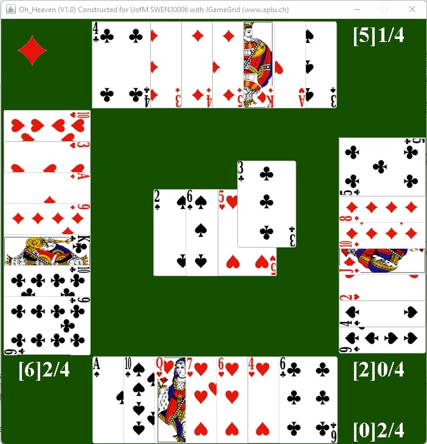

#  SWEN30006 Project 2 
This repository is created for SWEN30006 Project 2 Semester 1 2022, Group Project
---

## Problem Context
Off the back of their overwhelming success with Snakes and Ladders on a Plane (sales went into double digits!), NERDI are back to work on their new game. While NERDI have learnt some lessons (sadly, none related to object oriented design), they still need the help of you and your team to assist them in getting their Oh Heaven card game market ready.
 
 
NERDI have a fully running version of the game, but the design is not very extendible or maintainable, it is limited in terms of configurability, and needs more NPC (Non-Playable Cardplayer) options.

---

 

 
---

## Team members
| Name | Student ID |
| ---- | ---- |
| Ziqiang Li | 1173898 |
| Junzhi Ning | 1086241 |
| Lujia Yang | 1174148 |

---
## Tutorial Time

Workshop 14 14:30 - 16:30
 

## Structures of folders: 
- `Oh_Heaven`:
	- `lib`: Game Framework Prototype and files
	- `sprites`:  Testing puposes and Game behaviour control
	- `properties`: Project resourses, including images, sound, icons etc
	- `src`: Main structure of the game program

---
## Report and Software Design Diagrams:

The report link is at https://www.overleaf.com/3295722264jqmccgwbfwtm
Notion Link: https://www.notion.so/Assignment2-e7975df0c393437e980677258291ae21

---
## Software Installaition and Running:
If it is your first time to open this project, make sure you open the program folder at the correct directory level.
<pre>
<code>   
</code></pre>
---
## Others:
